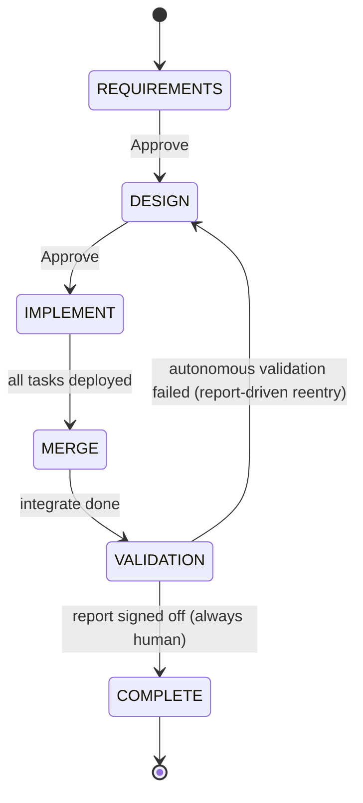
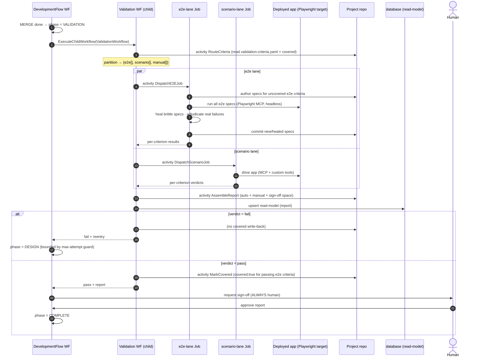

# Requirement Validation — Design Overview

> Status: **design / proposed**. Target: the `aep` rewrite (`services/orchestrator` + the project repo
> built by AEP). Companion ADR: `docs/decisions/ADR-0005-validation-phase.md`.
> Builds on the orchestration design (`docs/design/orchestration/00-overview.md`).

This document describes how AEP validates that a delivered change actually **satisfies the user's
requirements**. It introduces a structured acceptance artifact (`validation-criteria.yaml`), a new
durable **VALIDATION phase** in the development cycle, and the agents/workflows that run it.

Two repos are in play. **AEP** (this repo) is the platform that authors and runs validation. The
**project repo** is the application AEP is building; `validation-criteria.yaml`, the generated e2e
tests, and the validation report all live there, committed alongside the project's own `design.md`.

---

## 1. Why a validation phase

The cycle (`requirements → design → implement → merge → complete`) has no point at which AEP checks
that what was built matches what the user asked for. The gate machinery can *advance* the flow, but
"done" is asserted, never verified. For a spec-driven platform that is the missing keystone: without it,
autonomous mode can ship a confident, wrong result.

Validation closes that gap by making requirement-satisfaction a **first-class, durable phase** with its
own artifact, agents, and human sign-off — not an ad-hoc check bolted onto an existing gate.

---

## 2. The acceptance artifact — `validation-criteria.yaml`

The hybrid approach (executable tests + agentic judgment + traceability) only works if requirements are
**structured and addressable**. Free-form prose cannot be traced or tested. So a dedicated agent
compiles the prose requirement into a structured mirror.

- **Authored by `validation-criteria-author`** on the **requirements → design** transition.
- **Derived from the prose requirement only** — never from `design.md` or the code. Feeding it the
  design would bend the criteria toward what was built, collapsing the independent oracle. The criteria
  may legitimately demand something the design missed; that is the point.
- **Committed and human-reviewed**, exactly like `design.md`: generated and committed directly (no PR),
  re-committed on edits, reviewed as the committed file. It is the documented exception to the
  repo's "generated artifacts are gitignored" rule, because it is the **oracle for all downstream
  validation** and a bad one silently corrupts every check.
- **Location:** `specs/validation/validation-criteria.yaml` in the **project repo**.

### Schema

```yaml
# specs/validation/validation-criteria.yaml   (in the PROJECT repo)
requirements:
  - id: REQ-001
    statement: "Users can reset their password via email"
    criteria:
      - id: AC-001-a
        must: "A registered email receives a reset link"
        method: e2e            # e2e | scenario | manual
        covered: false         # set true after a passing e2e run; skips regeneration
      - id: AC-001-b
        must: "Reset link expires after 1 hour"
        method: e2e
        covered: false
      - id: AC-001-c
        must: "The reset confirmation message is clear and actionable"
        method: scenario
```

- **`method`** routes a criterion into a lane: `e2e` (a generated, committed test), `scenario` (an agent
  drives the app and judges), `manual` (a human must check it).
- **`covered`** is a **validation-owned** field: set `true` after a criterion's e2e test passes, so
  future cycles re-run the committed test instead of regenerating it.

> **Deferred (parked):** stable criterion IDs across regeneration, and a freshness/invalidation contract
> for when the requirement itself changes. Both are out of scope until requirement-change handling is
> finalized; the schema leaves room (`id`, a future `sourceHash`) so they slot in without reshaping.

### Does the artifact feed the design phase? Two variants

Both are viable; the proposal carries both so the choice is explicit (see ADR-0005).

- **Variant A — criteria feed design.** `validation-criteria.yaml` is an *input* to the design and
  coding agents ("here is what done means"). Upside: better-aimed implementations, fewer validation
  loop-backs. Downside: the oracle now influences the work it grades, weakening independence.
- **Variant B — review-only oracle (recommended default).** The file is committed beside `design.md`
  for human review and does **not** feed design. The oracle stays fully independent of the work; a
  design that misses a requirement gets caught at VALIDATION rather than quietly satisfied by a criteria
  set that was shown to the designer.

---

## 3. The VALIDATION phase

A new durable phase between MERGE and COMPLETE.



`DevelopmentFlowWorkflow` enters VALIDATION after MERGE and starts a **`ValidationWorkflow` child**
(mirroring how it starts `TaskLifecycleWorkflow` during IMPLEMENT). The child encapsulates the fan-out,
retries, and report assembly; `DevelopmentFlowWorkflow` only awaits the verdict and routes pass/fail.

### Why a child workflow, but not per-criterion task workflows

| Question | Decision | Reason |
|---|---|---|
| Child workflow for the phase? | **Yes** (`ValidationWorkflow`) | Encapsulates fan-out + retries; keeps the parent state machine simple; own timeline in the Temporal UI; independently testable. |
| Per-criterion `TaskLifecycleWorkflow`-style children? | **No** | A criterion is a bounded agentic loop, not a long-lived, webhook-driven state machine. There is no external-event wait and no inter-criterion dependency, so a per-unit child buys overhead without the lifecycle benefit. |
| Reuse the task tier's Job dispatch? | **Yes** | Validation needs an isolated runtime (headless browser + app-under-test + MCP + agent) — a k8s Job in `wc-<org>-remote-worker` under the per-org `ResourceQuota`, the same machinery coding-agent tasks use. |

Net: **structured like the task tier (child workflow + Jobs), but with an activity-batch lifecycle (no
per-unit state machine).**

### Lanes and Jobs (per-lane, not per-criterion)

Browser boot + app boot is the expensive shared cost, so the unit of work is the **lane**, not the
criterion. Two Jobs per validation pass, dispatched concurrently:

- **e2e-lane Job** — `e2e-test-author` generates tests for uncovered `e2e` criteria; runs **all** e2e
  specs (new + previously `covered`, so regression is free) against one running app instance via the
  Playwright MCP (headless browser; another framework for non-UI criteria); `e2e-test-healer` repairs
  brittle specs. New/healed specs are committed; passing criteria are marked `covered`.
- **scenario-lane Job** — `scenario-validator` drives the app via the Playwright MCP + custom tools for
  `scenario` criteria and renders a verdict.

Parallelism across criteria happens **inside** each Job (Playwright runs specs in parallel), not across
Jobs. `manual` criteria run no Job; they are collected straight into the report.

> Inspired by Playwright's agent roles (planner / generator / healer). Pull their current docs when
> specifying the agent prompts — the exact contracts have shifted recently.

### Agents

| Agent | Runs at | Role |
|---|---|---|
| `validation-criteria-author` | req → design | Compiles the prose requirement into `validation-criteria.yaml`. |
| `e2e-test-author` | VALIDATION (e2e Job) | Generates committed e2e specs from uncovered `e2e` criteria. |
| `e2e-test-healer` | VALIDATION (e2e Job) | Repairs **brittle** specs (selector/timing/setup drift) only. |
| `scenario-validator` | VALIDATION (scenario Job) | Validates `scenario` criteria via MCP + custom tools. |

**Failure diagnosis** is a *responsibility*, not (yet) a standalone agent: each lane agent's
per-criterion result carries `{verdict, reason, reentry}` for real failures. It is promotable to a
dedicated agent later if independence becomes worth the cost.

### The healer must never mask a real failure

A failing spec is either **brittle** (app fine, spec stale) or a **real violation** (app breaks the
criterion). The healer may fix only the former. If it "heals until green," it edits a true failure into
a false pass — the single most dangerous outcome of this feature.

The real-vs-brittle adjudication is therefore kept **independent of the healer** (whose incentive is
green tests). In v1 the healer's contract is strict: repair locators/waits/setup only; anything that
looks like a genuine assertion failure is handed to diagnosis as a **real** fail, not healed.

### Report assembly

A **deterministic `AssembleReport` activity** (not an agent) merges lane results into a fixed schema so
the verdict is reproducible. The report covers: what was auto-validated (pass/fail, which lane), what
remains **manual** (the human's checklist), and space to mark off by hand. It is committed to the
project repo and written to the `database` read-model for the Console.

### Verdict, sign-off, and loop-back

- **Sign-off is always human.** The report-review gate is **not** subject to `GatePolicy`. Even in fully
  autonomous mode, a cycle cannot reach COMPLETE without a human signing off. This dissolves the
  manual-only-criteria problem (the human validates those at sign-off) and is a deliberate cap: **no
  cycle ever auto-COMPLETEs.**
- **Execution autonomy is separate from sign-off.** The validation *run* is fully automated. Only the
  final approval is mandatory-human.
- **Fail auto-loops to DESIGN** (autonomous self-correction, no human in the loop), with a
  **report-driven `reentry`** field: `design` (default), `implement` (enabled once an IMPLEMENT-phase
  design-conformance check exists), or `criteria` (the criterion itself looks wrong). The unmet-criteria
  list feeds the next pass.
- **A max-attempt guard bounds the loop.** Repeated failures must not spin DESIGN → IMPLEMENT → MERGE →
  VALIDATION forever with no human present. After N attempts, escalate to a human instead of looping
  (trivial as `ValidationWorkflow`/cycle state).

---

## 4. Sequence



---

## 5. v1 scope

- **Satisfaction checks at the VALIDATION phase only.** No DESIGN-gate traceability and no per-task
  validation in v1.
- All three lanes (`e2e`, `scenario`, `manual`) and the artifact lifecycle land together, because the
  report is only honest if it accounts for every criterion.
- The deployed-app dependency (below) must be satisfied for the e2e/scenario lanes to run.

---

## 6. Temporal integration

- **All I/O lives in activities** (Job dispatch, agent runs, git commits, report writes, `covered`
  write-back). `ValidationWorkflow` only orchestrates and branches on the **recorded** verdict, so
  replay stays deterministic — the non-deterministic agent/judge output is captured once in an activity,
  never re-derived on replay.
- **Lanes fan out via two concurrent activity futures**; the workflow joins them before assembling the
  report.
- **Sign-off reuses the gate machinery** as a `human` await; here it is non-skippable regardless of
  `GatePolicy`.
- **Loop-back is just a phase set** on `DevelopmentFlowWorkflow`; the attempt counter is workflow state.
- **Jobs reuse** the coding-agent dispatch activity + `wc-<org>-remote-worker` `ResourceQuota` (browser
  Jobs need more memory — a sizing detail, not a topology change).

---

## 7. Dependencies & open items

- **Running app to validate.** Playwright needs a live target. After MERGE the cycle's tasks are
  deployed, so a URL should exist in the org dev env; confirm it is stable/reachable from the validation
  Job, or stand up an ephemeral validation deployment. This is a real prerequisite, not a detail.
- **Test-oracle trust.** e2e specs are authored by `e2e-test-author`, independent of the coding agent
  that wrote the app — so the implementer does not write its own acceptance tests. Keep that separation.
- **Deferred / future:**
  - Requirement-change handling (criterion ID stability + freshness/invalidation) — parked.
  - Per-task design-conformance check in IMPLEMENT — turns on `reentry: implement`.
  - DESIGN-gate traceability (design covers every criterion) — natural next phase after v1.
  - `covered` vs regeneration collision — regeneration (later) must preserve/reset `covered`
    deliberately.

---

## 8. Advantages

- **Requirement-satisfaction is verified, not asserted** — the missing keystone of a spec-driven flow.
- **Independent oracle** — criteria authored from the requirement, tests authored independent of the
  implementer; nobody grades their own work.
- **Regression for free** — committed e2e specs re-run every cycle; `covered` avoids needless
  regeneration.
- **Autonomous self-correction with a human backstop** — fail auto-loops to DESIGN; pass always stops
  for human sign-off, so a confident-but-wrong result can never ship unattended.
- **Reuses existing machinery** — child-workflow tier, Job dispatch, per-org quota, read-models, gate
  await; little new infrastructure.

---

## 9. Complexities (and how we manage them)

| Complexity | Why it exists | Mitigation |
|---|---|---|
| **Healer false-pass** | A healer's incentive is green tests; it could edit a real failure into passing. | Real-vs-brittle adjudication kept independent of the healer; strict healer contract (locators/waits/setup only); genuine assertion failures route to diagnosis as real fails. |
| **Oracle quality** | `validation-criteria.yaml` grades everything downstream; a bad one corrupts all checks. | Committed + human-reviewed like `design.md`; derived from the requirement only (Variant B default keeps it uninfluenced by design). |
| **Infinite loop-back** | Autonomous fail → DESIGN with no human present. | Max-attempt guard escalates to a human after N attempts. |
| **Agent/judge non-determinism** | Workflow replay breaks on nondeterministic output. | All agent output captured once in activities; workflow branches on recorded verdict only. |
| **Job cost** | Each Job spins a browser + app + MCP + agent. | Per-lane (not per-criterion) Jobs; parallelism inside the Job; reuse per-org quota. |
| **Deployed-app prerequisite** | e2e/scenario lanes need a live target. | Validate against the post-MERGE dev deployment, or an ephemeral validation env; confirm reachability before the lane runs. |
| **`covered` vs regeneration** | Two writers touch `validation-criteria.yaml`. | `covered` is validation-owned; regeneration (deferred) must preserve/reset it explicitly. |

---

## 10. References

- `docs/design/orchestration/00-overview.md` — the cycle, gates, task tier, Job dispatch this builds on.
- `docs/decisions/ADR-0005-validation-phase.md` — the decisions (VALIDATION phase, artifact lifecycle,
  Variant A/B, child-workflow-not-task, always-human sign-off).
- Playwright agents (planner / generator / healer) + Playwright MCP — verify against current docs when
  specifying agent prompts.
