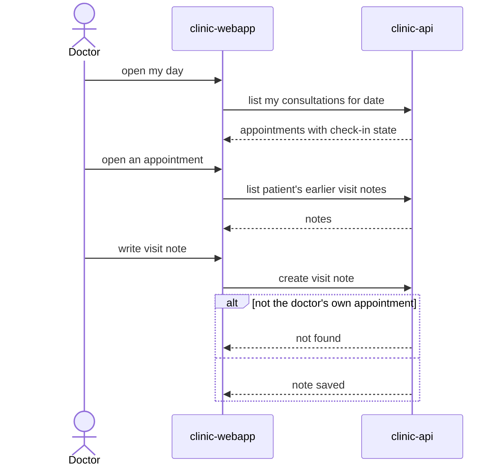

# Doctor's day and visit notes

A doctor opens their day, sees who has arrived, and writes a visit note only doctors can read.

```mermaid
sequenceDiagram
    actor Doctor
    participant clinic-webapp
    participant clinic-api

    Doctor->>clinic-webapp: open my day
    clinic-webapp->>clinic-api: list my consultations for date
    clinic-api-->>clinic-webapp: appointments with check-in state
    Doctor->>clinic-webapp: open an appointment
    clinic-webapp->>clinic-api: list patient's earlier visit notes
    clinic-api-->>clinic-webapp: notes
    Doctor->>clinic-webapp: write visit note
    clinic-webapp->>clinic-api: create visit note
    alt not the doctor's own appointment
        clinic-api-->>clinic-webapp: not found
    else
        clinic-api-->>clinic-webapp: note saved
    end
```
