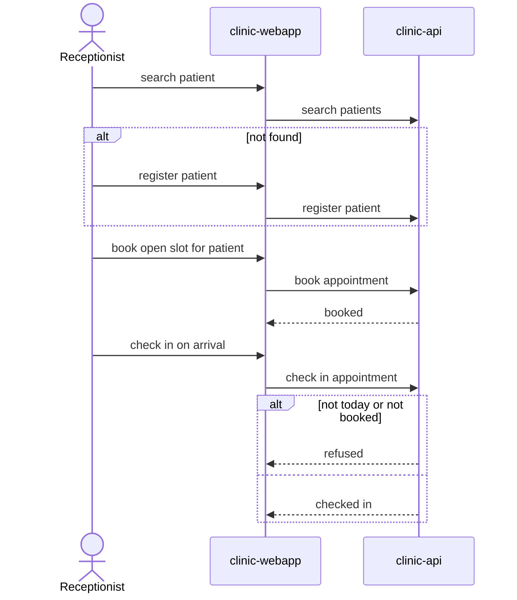

# Reception books and checks in

A receptionist finds or registers a patient, books for them, and checks them in on the day.

```mermaid
sequenceDiagram
    actor Receptionist
    participant clinic-webapp
    participant clinic-api

    Receptionist->>clinic-webapp: search patient
    clinic-webapp->>clinic-api: search patients
    alt not found
        Receptionist->>clinic-webapp: register patient
        clinic-webapp->>clinic-api: register patient
    end
    Receptionist->>clinic-webapp: book open slot for patient
    clinic-webapp->>clinic-api: book appointment
    clinic-api-->>clinic-webapp: booked
    Receptionist->>clinic-webapp: check in on arrival
    clinic-webapp->>clinic-api: check in appointment
    alt not today or not booked
        clinic-api-->>clinic-webapp: refused
    else
        clinic-api-->>clinic-webapp: checked in
    end
```
