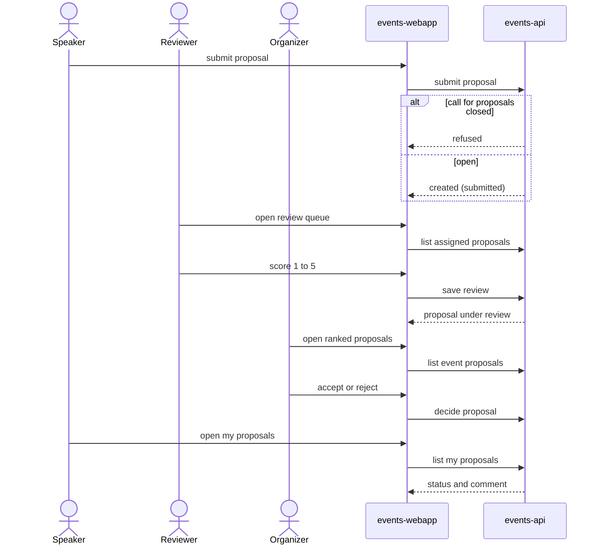

# Proposal review

A speaker submits a proposal, reviewers score it, and an organizer accepts or rejects it.

```mermaid
sequenceDiagram
    actor Speaker
    actor Reviewer
    actor Organizer
    participant events-webapp
    participant events-api

    Speaker->>events-webapp: submit proposal
    events-webapp->>events-api: submit proposal
    alt call for proposals closed
        events-api-->>events-webapp: refused
    else open
        events-api-->>events-webapp: created (submitted)
    end
    Reviewer->>events-webapp: open review queue
    events-webapp->>events-api: list assigned proposals
    Reviewer->>events-webapp: score 1 to 5
    events-webapp->>events-api: save review
    events-api-->>events-webapp: proposal under review
    Organizer->>events-webapp: open ranked proposals
    events-webapp->>events-api: list event proposals
    Organizer->>events-webapp: accept or reject
    events-webapp->>events-api: decide proposal
    Speaker->>events-webapp: open my proposals
    events-webapp->>events-api: list my proposals
    events-api-->>events-webapp: status and comment
```
