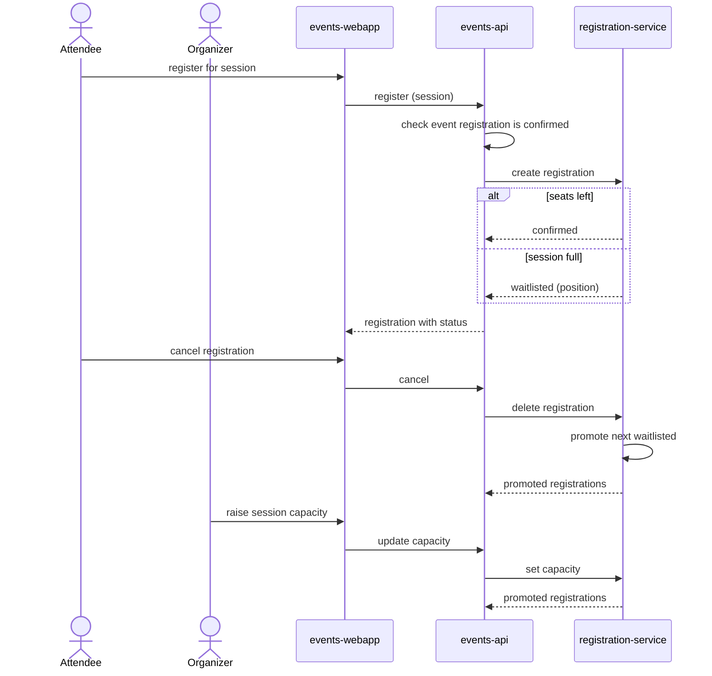

# Register and waitlist

An attendee registers for a session; when the session is full they are waitlisted, and the next waitlisted attendee is promoted when a seat frees up.

```mermaid
sequenceDiagram
    actor Attendee
    actor Organizer
    participant events-webapp
    participant events-api
    participant registration-service

    Attendee->>events-webapp: register for session
    events-webapp->>events-api: register (session)
    events-api->>events-api: check event registration is confirmed
    events-api->>registration-service: create registration
    alt seats left
        registration-service-->>events-api: confirmed
    else session full
        registration-service-->>events-api: waitlisted (position)
    end
    events-api-->>events-webapp: registration with status
    Attendee->>events-webapp: cancel registration
    events-webapp->>events-api: cancel
    events-api->>registration-service: delete registration
    registration-service->>registration-service: promote next waitlisted
    registration-service-->>events-api: promoted registrations
    Organizer->>events-webapp: raise session capacity
    events-webapp->>events-api: update capacity
    events-api->>registration-service: set capacity
    registration-service-->>events-api: promoted registrations
```
