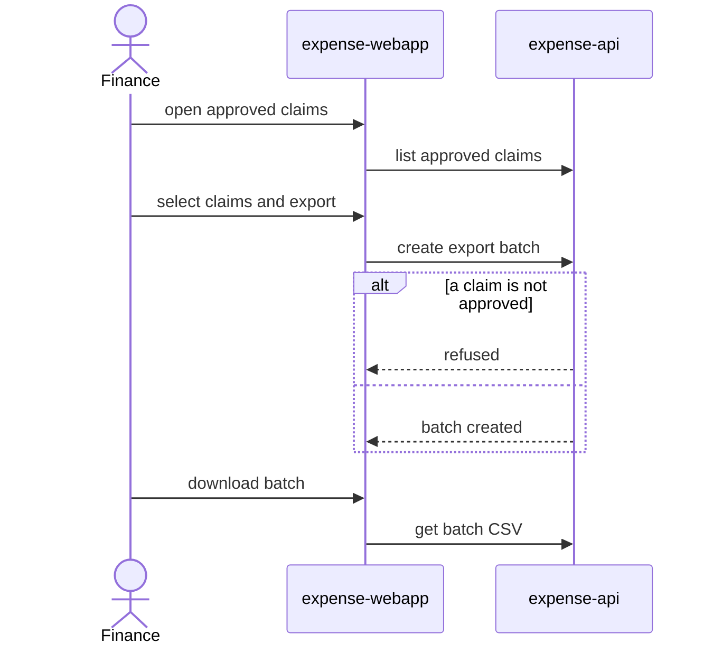

# Export approved claims

A finance user exports approved claims to payroll as a CSV batch.

```mermaid
sequenceDiagram
    actor Finance
    participant expense-webapp
    participant expense-api

    Finance->>expense-webapp: open approved claims
    expense-webapp->>expense-api: list approved claims
    Finance->>expense-webapp: select claims and export
    expense-webapp->>expense-api: create export batch
    alt a claim is not approved
        expense-api-->>expense-webapp: refused
    else
        expense-api-->>expense-webapp: batch created
    end
    Finance->>expense-webapp: download batch
    expense-webapp->>expense-api: get batch CSV
```
