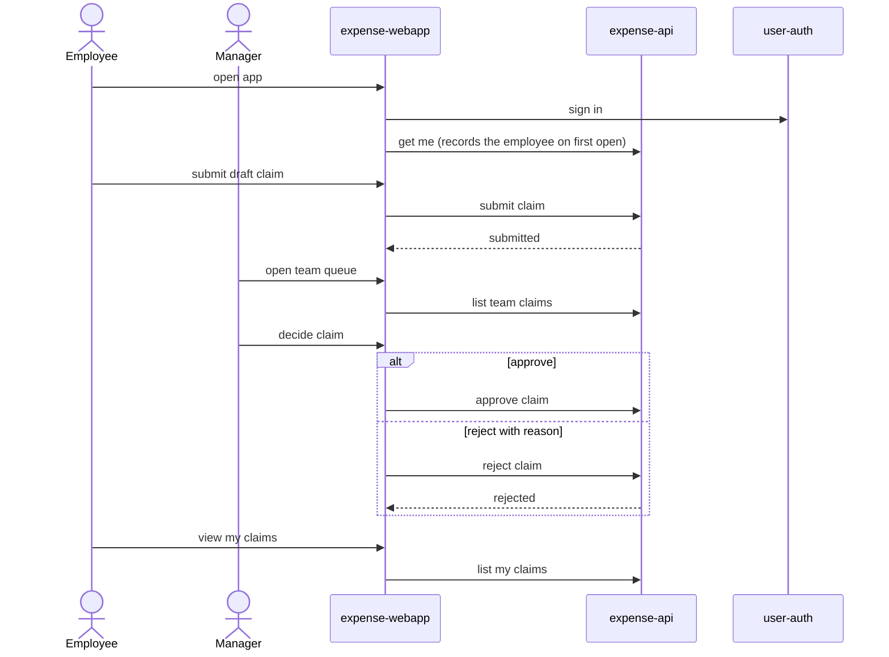

# Submit and approve a claim

An employee submits a claim and their manager approves or rejects it; a rejected claim returns to the employee.

```mermaid
sequenceDiagram
    actor Employee
    actor Manager
    participant expense-webapp
    participant expense-api
    participant user-auth

    Employee->>expense-webapp: open app
    expense-webapp->>user-auth: sign in
    expense-webapp->>expense-api: get me (records the employee on first open)
    Employee->>expense-webapp: submit draft claim
    expense-webapp->>expense-api: submit claim
    expense-api-->>expense-webapp: submitted
    Manager->>expense-webapp: open team queue
    expense-webapp->>expense-api: list team claims
    Manager->>expense-webapp: decide claim
    alt approve
        expense-webapp->>expense-api: approve claim
    else reject with reason
        expense-webapp->>expense-api: reject claim
        expense-api-->>expense-webapp: rejected
    end
    Employee->>expense-webapp: view my claims
    expense-webapp->>expense-api: list my claims
```
