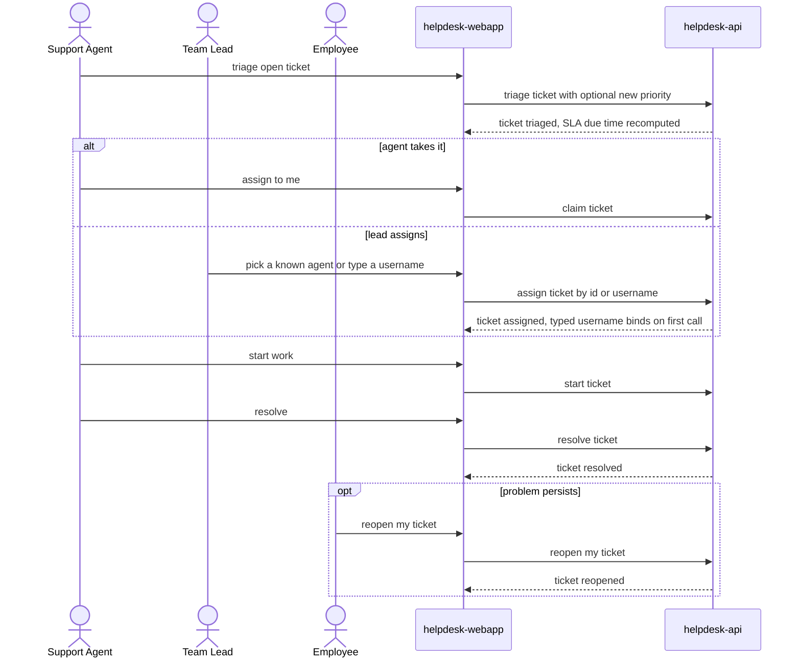

# Handle a ticket

A support agent triages, works and resolves a ticket, a team lead can assign it, and the employee may reopen it.

```mermaid
sequenceDiagram
    actor SupportAgent as Support Agent
    actor TeamLead as Team Lead
    actor Employee
    participant helpdesk-webapp
    participant helpdesk-api

    SupportAgent->>helpdesk-webapp: triage open ticket
    helpdesk-webapp->>helpdesk-api: triage ticket with optional new priority
    helpdesk-api-->>helpdesk-webapp: ticket triaged, SLA due time recomputed
    alt agent takes it
        SupportAgent->>helpdesk-webapp: assign to me
        helpdesk-webapp->>helpdesk-api: claim ticket
    else lead assigns
        TeamLead->>helpdesk-webapp: pick a known agent or type a username
        helpdesk-webapp->>helpdesk-api: assign ticket by id or username
        helpdesk-api-->>helpdesk-webapp: ticket assigned, typed username binds on first call
    end
    SupportAgent->>helpdesk-webapp: start work
    helpdesk-webapp->>helpdesk-api: start ticket
    SupportAgent->>helpdesk-webapp: resolve
    helpdesk-webapp->>helpdesk-api: resolve ticket
    helpdesk-api-->>helpdesk-webapp: ticket resolved
    opt problem persists
        Employee->>helpdesk-webapp: reopen my ticket
        helpdesk-webapp->>helpdesk-api: reopen my ticket
        helpdesk-api-->>helpdesk-webapp: ticket reopened
    end
```
