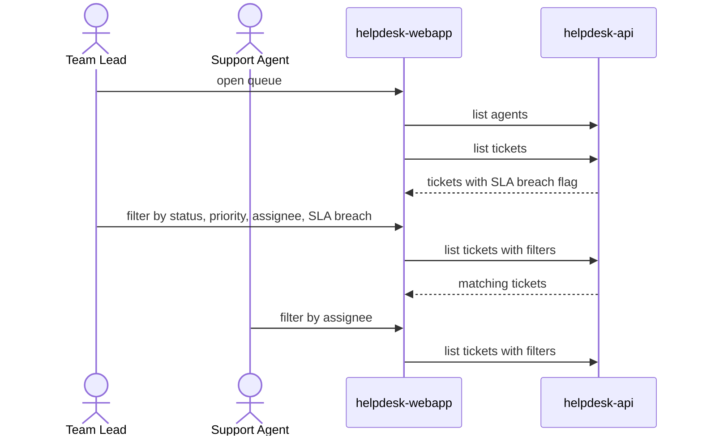

# Monitor the queue

A team lead or support agent filters the queue to find overdue or unassigned tickets.

```mermaid
sequenceDiagram
    actor TeamLead as Team Lead
    actor SupportAgent as Support Agent
    participant helpdesk-webapp
    participant helpdesk-api

    TeamLead->>helpdesk-webapp: open queue
    helpdesk-webapp->>helpdesk-api: list agents
    helpdesk-webapp->>helpdesk-api: list tickets
    helpdesk-api-->>helpdesk-webapp: tickets with SLA breach flag
    TeamLead->>helpdesk-webapp: filter by status, priority, assignee, SLA breach
    helpdesk-webapp->>helpdesk-api: list tickets with filters
    helpdesk-api-->>helpdesk-webapp: matching tickets
    SupportAgent->>helpdesk-webapp: filter by assignee
    helpdesk-webapp->>helpdesk-api: list tickets with filters
```
