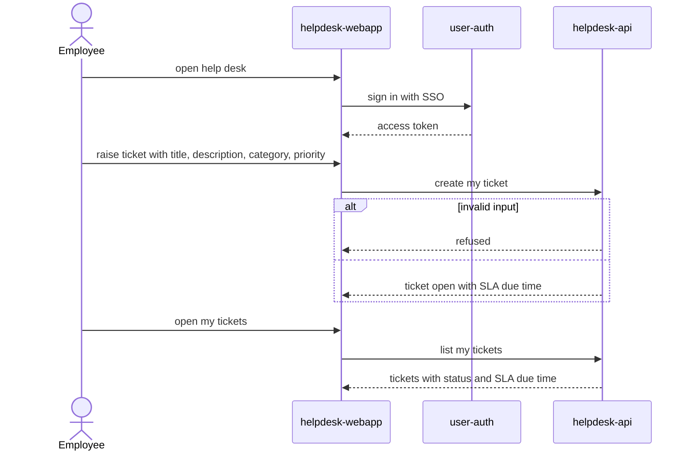

# Raise and track a ticket

An employee signs in, raises a ticket and follows it in their own list.

```mermaid
sequenceDiagram
    actor Employee
    participant helpdesk-webapp
    participant user-auth
    participant helpdesk-api

    Employee->>helpdesk-webapp: open help desk
    helpdesk-webapp->>user-auth: sign in with SSO
    user-auth-->>helpdesk-webapp: access token
    Employee->>helpdesk-webapp: raise ticket with title, description, category, priority
    helpdesk-webapp->>helpdesk-api: create my ticket
    alt invalid input
        helpdesk-api-->>helpdesk-webapp: refused
    else
        helpdesk-api-->>helpdesk-webapp: ticket open with SLA due time
    end
    Employee->>helpdesk-webapp: open my tickets
    helpdesk-webapp->>helpdesk-api: list my tickets
    helpdesk-api-->>helpdesk-webapp: tickets with status and SLA due time
```
