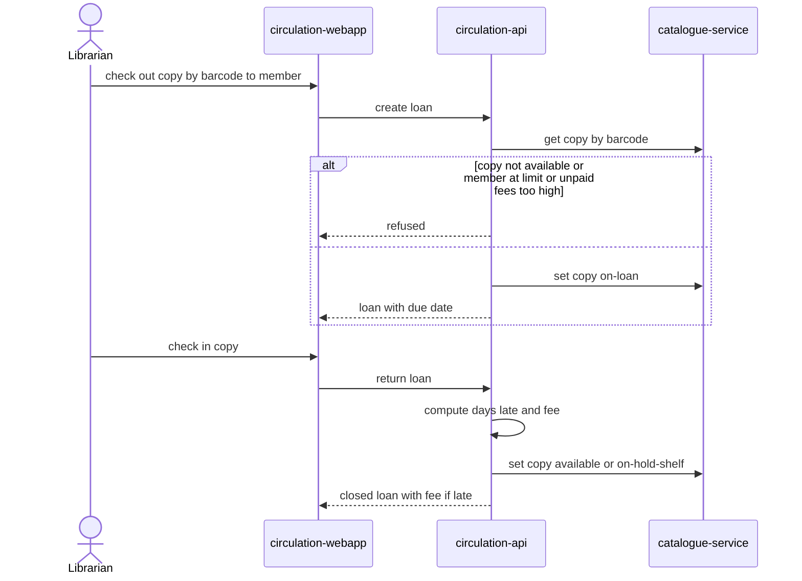

# Check out and return with a late fee

A librarian checks a copy out to a member and later checks it in; a late return creates a fee.

```mermaid
sequenceDiagram
    actor Librarian
    participant circulation-webapp
    participant circulation-api
    participant catalogue-service

    Librarian->>circulation-webapp: check out copy by barcode to member
    circulation-webapp->>circulation-api: create loan
    circulation-api->>catalogue-service: get copy by barcode
    alt copy not available or member at limit or unpaid fees too high
        circulation-api-->>circulation-webapp: refused
    else
        circulation-api->>catalogue-service: set copy on-loan
        circulation-api-->>circulation-webapp: loan with due date
    end
    Librarian->>circulation-webapp: check in copy
    circulation-webapp->>circulation-api: return loan
    circulation-api->>circulation-api: compute days late and fee
    circulation-api->>catalogue-service: set copy available or on-hold-shelf
    circulation-api-->>circulation-webapp: closed loan with fee if late
```
