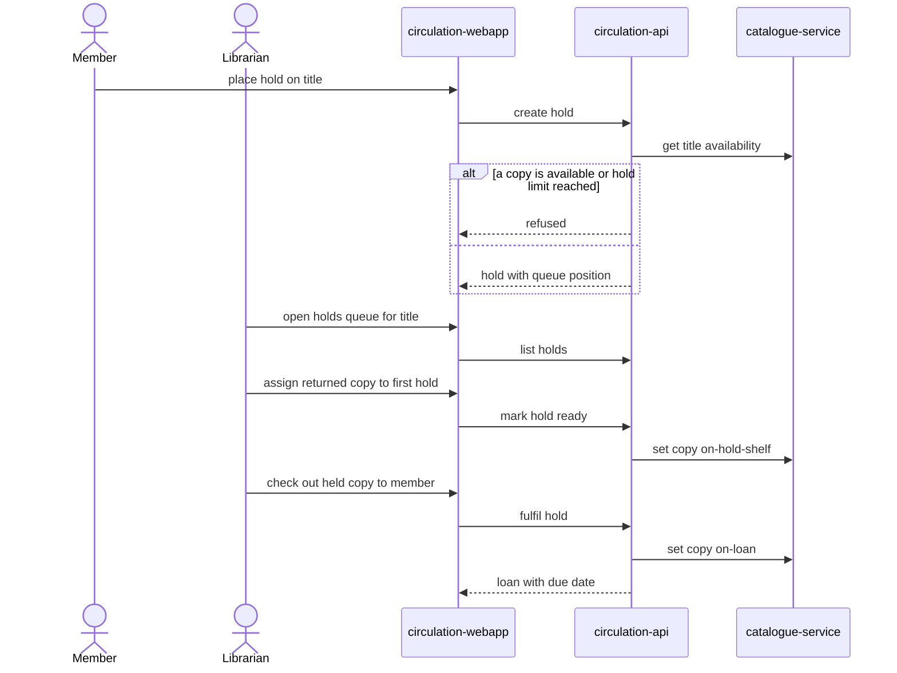

# Hold queue and pickup

A member places a hold on an unavailable title; a librarian assigns a returned copy to the first hold and later fulfils it at pickup.

```mermaid
sequenceDiagram
    actor Member
    actor Librarian
    participant circulation-webapp
    participant circulation-api
    participant catalogue-service

    Member->>circulation-webapp: place hold on title
    circulation-webapp->>circulation-api: create hold
    circulation-api->>catalogue-service: get title availability
    alt a copy is available or hold limit reached
        circulation-api-->>circulation-webapp: refused
    else
        circulation-api-->>circulation-webapp: hold with queue position
    end
    Librarian->>circulation-webapp: open holds queue for title
    circulation-webapp->>circulation-api: list holds
    Librarian->>circulation-webapp: assign returned copy to first hold
    circulation-webapp->>circulation-api: mark hold ready
    circulation-api->>catalogue-service: set copy on-hold-shelf
    Librarian->>circulation-webapp: check out held copy to member
    circulation-webapp->>circulation-api: fulfil hold
    circulation-api->>catalogue-service: set copy on-loan
    circulation-api-->>circulation-webapp: loan with due date
```
