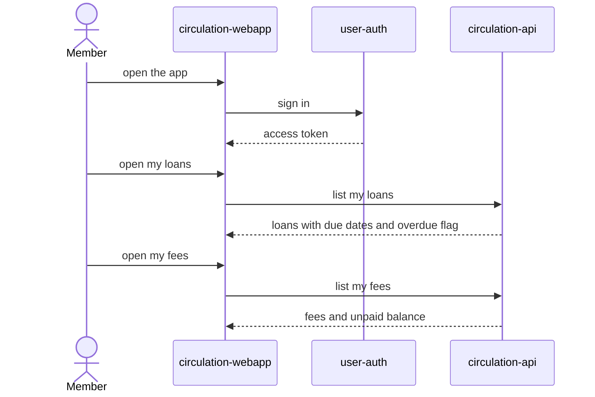

# Member sees loans and fees

A member signs in and reviews their own loans, holds and fees.

```mermaid
sequenceDiagram
    actor Member
    participant circulation-webapp
    participant user-auth
    participant circulation-api

    Member->>circulation-webapp: open the app
    circulation-webapp->>user-auth: sign in
    user-auth-->>circulation-webapp: access token
    Member->>circulation-webapp: open my loans
    circulation-webapp->>circulation-api: list my loans
    circulation-api-->>circulation-webapp: loans with due dates and overdue flag
    Member->>circulation-webapp: open my fees
    circulation-webapp->>circulation-api: list my fees
    circulation-api-->>circulation-webapp: fees and unpaid balance
```
