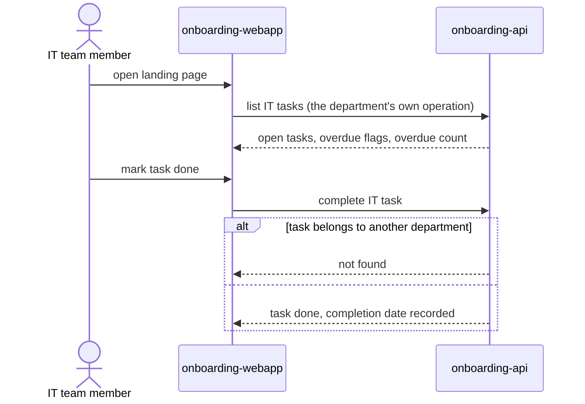

# Complete a department task

An IT team member sees their department's tasks, with overdue ones flagged, and marks one done. HR and Facilities team members follow the same journey.

```mermaid
sequenceDiagram
    actor ITTeamMember as IT team member
    participant onboarding-webapp
    participant onboarding-api

    ITTeamMember->>onboarding-webapp: open landing page
    onboarding-webapp->>onboarding-api: list IT tasks (the department's own operation)
    onboarding-api-->>onboarding-webapp: open tasks, overdue flags, overdue count
    ITTeamMember->>onboarding-webapp: mark task done
    onboarding-webapp->>onboarding-api: complete IT task
    alt task belongs to another department
        onboarding-api-->>onboarding-webapp: not found
    else
        onboarding-api-->>onboarding-webapp: task done, completion date recorded
    end
```
