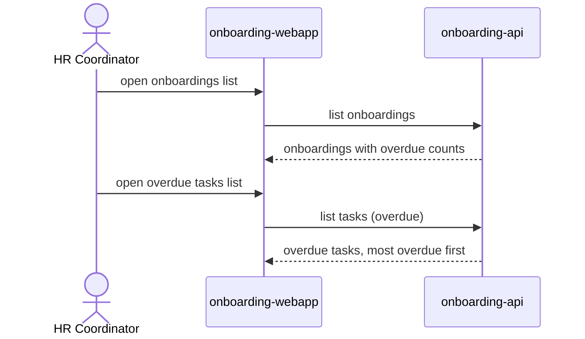

# Review overdue tasks

An HR coordinator reviews overdue tasks across departments and spots new hires at risk.

```mermaid
sequenceDiagram
    actor HRCoordinator as HR Coordinator
    participant onboarding-webapp
    participant onboarding-api

    HRCoordinator->>onboarding-webapp: open onboardings list
    onboarding-webapp->>onboarding-api: list onboardings
    onboarding-api-->>onboarding-webapp: onboardings with overdue counts
    HRCoordinator->>onboarding-webapp: open overdue tasks list
    onboarding-webapp->>onboarding-api: list tasks (overdue)
    onboarding-api-->>onboarding-webapp: overdue tasks, most overdue first
```
