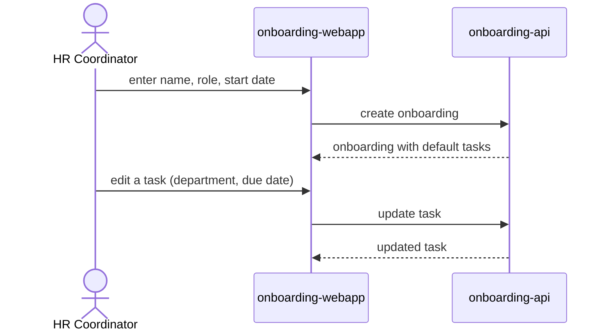

# Start an onboarding

An HR coordinator starts an onboarding for a new hire and adjusts the seeded tasks.

```mermaid
sequenceDiagram
    actor HRCoordinator as HR Coordinator
    participant onboarding-webapp
    participant onboarding-api

    HRCoordinator->>onboarding-webapp: enter name, role, start date
    onboarding-webapp->>onboarding-api: create onboarding
    onboarding-api-->>onboarding-webapp: onboarding with default tasks
    HRCoordinator->>onboarding-webapp: edit a task (department, due date)
    onboarding-webapp->>onboarding-api: update task
    onboarding-api-->>onboarding-webapp: updated task
```
