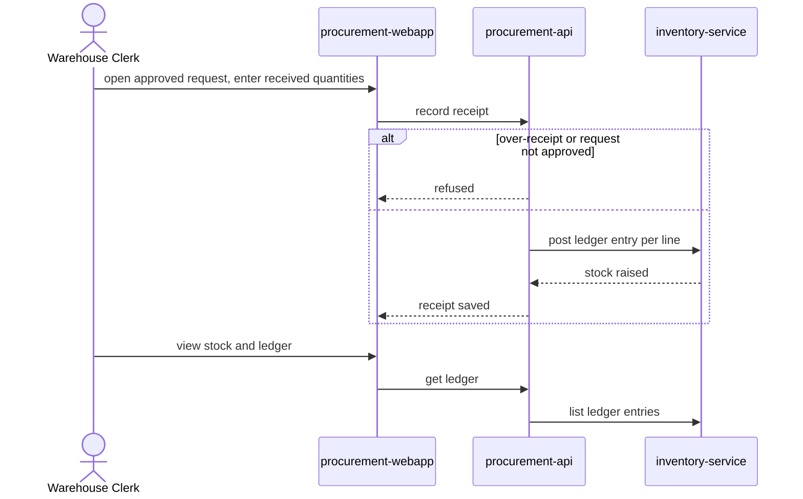

# Goods receiving

A WarehouseClerk receives goods against an approved request, which raises stock through ledger entries.

```mermaid
sequenceDiagram
    actor WarehouseClerk as Warehouse Clerk
    participant procurement-webapp
    participant procurement-api
    participant inventory-service

    WarehouseClerk->>procurement-webapp: open approved request, enter received quantities
    procurement-webapp->>procurement-api: record receipt
    alt over-receipt or request not approved
        procurement-api-->>procurement-webapp: refused
    else
        procurement-api->>inventory-service: post ledger entry per line
        inventory-service-->>procurement-api: stock raised
        procurement-api-->>procurement-webapp: receipt saved
    end
    WarehouseClerk->>procurement-webapp: view stock and ledger
    procurement-webapp->>procurement-api: get ledger
    procurement-api->>inventory-service: list ledger entries
```
