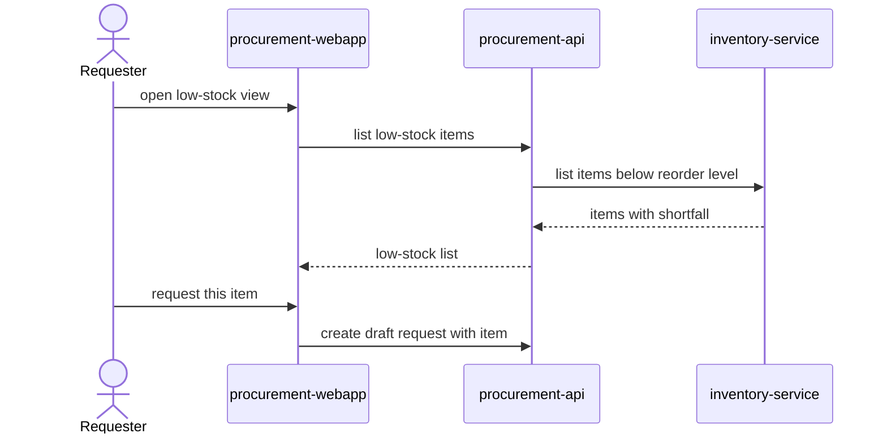

# Low-stock reorder

A Requester sees which items are below their reorder level and starts a purchase request for one.

```mermaid
sequenceDiagram
    actor Requester
    participant procurement-webapp
    participant procurement-api
    participant inventory-service

    Requester->>procurement-webapp: open low-stock view
    procurement-webapp->>procurement-api: list low-stock items
    procurement-api->>inventory-service: list items below reorder level
    inventory-service-->>procurement-api: items with shortfall
    procurement-api-->>procurement-webapp: low-stock list
    Requester->>procurement-webapp: request this item
    procurement-webapp->>procurement-api: create draft request with item
```
