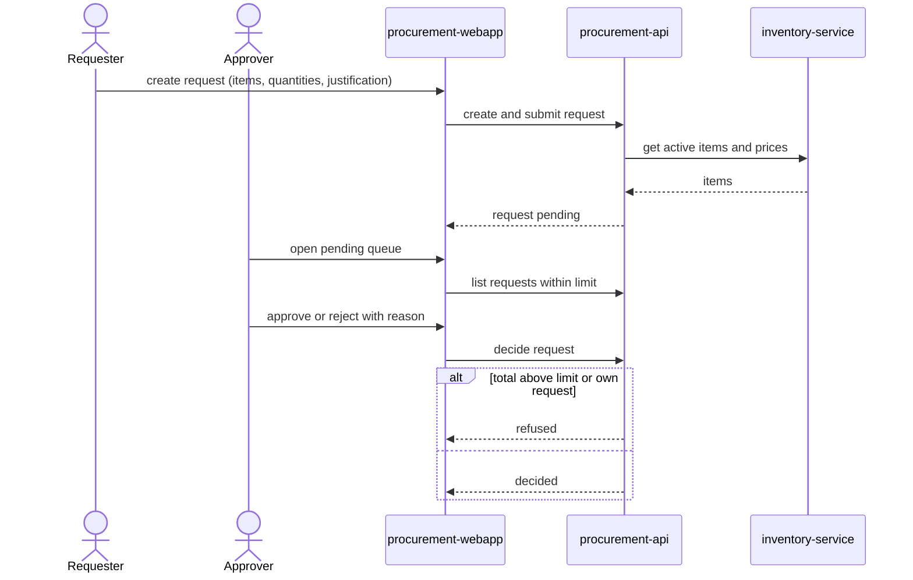

# Purchase request approval

A Requester raises and submits a request for catalogue items; an Approver within whose limit it falls approves or rejects it.

```mermaid
sequenceDiagram
    actor Requester
    actor Approver
    participant procurement-webapp
    participant procurement-api
    participant inventory-service

    Requester->>procurement-webapp: create request (items, quantities, justification)
    procurement-webapp->>procurement-api: create and submit request
    procurement-api->>inventory-service: get active items and prices
    inventory-service-->>procurement-api: items
    procurement-api-->>procurement-webapp: request pending
    Approver->>procurement-webapp: open pending queue
    procurement-webapp->>procurement-api: list requests within limit
    Approver->>procurement-webapp: approve or reject with reason
    procurement-webapp->>procurement-api: decide request
    alt total above limit or own request
        procurement-api-->>procurement-webapp: refused
    else
        procurement-api-->>procurement-webapp: decided
    end
```
