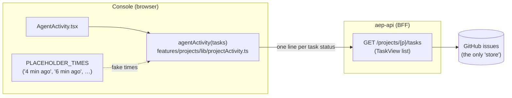
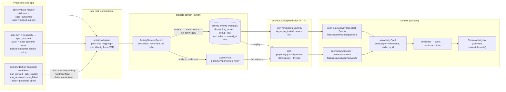

# Activity feed — how activity reaches the console (issue #239)

How the project overview's **Recent activity** panel gets its data: where events
are produced, where the state lives, and how it travels to the console — before
(shipped in #232, when the panel was named "Agent Activity") versus after
(backend #254 + console cutover #265).

## Before — client-side derivation (shipped in #232)

There is **no activity state anywhere**. The console derives the feed on render
from the build-task list, and the timestamps are hardcoded placeholders.

Consequences (why #239 exists):

- **State kept:** nowhere — the feed is a pure function of the current task
  list. History is lost the moment a task changes state.
- **Times are fiction** (`PLACEHOLDER_TIMES`); no per-task timestamps exist in
  the data.
- Only build-task statuses appear — no spec publishes, no plan derivation, no
  deploy events, no user attribution.
- With zero tasks (every project before a build), the panel is permanently
  empty.

## After — activity event store + replay/tail SSE (#254 backend + #265 console)

Producers append **ActivityEvent rows** to a dedicated Postgres table at the
moment something happens; the console reads one page and then tails an SSE
stream. State lives in exactly one place: the `activity_events` table, owned by
the **projects domain** in `aep-api`.

### Where the state is kept

| State | Where | Owner |
|---|---|---|
| The feed itself (append-only event log) | `activity_events` table, AutoMigrated via `migrate.BaseModels()` | `internal/projects` (entity + gorm repository at the domain root) |
| Live-tail wakeups | `ActivityHub`, in-memory per `(org, project)` — no persistence needed; a reconnect replays from the table | `internal/projects` |
| Event vocabulary (`spec_published`, `task_failed`, …) | `internal/contracts/activityvocab` — a pure leaf both producers (delivery) and the owner (projects) import | shared contract |
| Console's copy | TanStack Query cache (first page) + `useActivityFeed` in-memory live list, deduped by event `id` | `apps/console/src/features/activity` |

### Why the indirections

- **Twin types at the domain boundary.** `projects` already imports `delivery`,
  so delivery's producers cannot import `projects` back. Devflow records
  through its own `RecordedActivity` type and the build slice through a
  `SpecPublishedRecorder` port; app-root adapters
  (`internal/app/activity_adapters.go`) map onto `projects.ActivityInput`.
- **DedupKey, not at-most-once delivery.** Temporal retries and webhook
  redeliveries re-emit events; the `(org, project, dedup_key)` unique index
  makes a re-emit a no-op, and only a real insert notifies the hub.
- **Replay + tail, not a fragile push channel.** The SSE stream replays recent
  rows on every (re)connect; the client dedups by `id`. A dropped connection
  costs nothing — the same pattern as the task-log stream.
- **Best-effort recording.** `ActivityService.Record` swallows storage errors:
  the feed is observability, and must never fail a build or a workflow.

### Spec-edit attribution (who "updated the spec")

A `spec_updated` line can originate from three places, and only one of them
knows the agent was the author:

- **Committed genai turn** — the turn lands its own commit; the turn recorder
  writes the line as **Spec agent** (a turn is the agent working, so no user
  identity is involved).
- **Room-scoped genai turn** — the agent writes into the shared collab doc and
  commits nothing; the collab committer flushes the doc to git later via
  `files/apply` **under a participating user's token**. At the git layer the
  flush is indistinguishable from a manual edit, so the turn recorder writes the
  agent line at turn end and marks the manifest's paths in `specAuthorship`
  (app root, in-process). When an apply's commit contains a marked path, the
  files recorder claims those marks and suppresses its user line — the work is
  already on the feed as the agent.
- **Manual apply** (spec editor save, collab flush of hand edits) — no marked
  path matches, so the files recorder attributes the commit to the signed-in
  user from the request context. Each collaborator's flush carries their own
  token, so different users appear under their own names.

Marks are **per path**, not per project: the committer holds agent-marked
markdown until the session-end force flush, so a user's own edit can land in an
interim commit between the turn and that flush; path scoping lets that interim
commit record as the user while the agent's paths stay marked until they land.
Known limits, accepted for the single-replica deployment: one flush is one
commit and one feed line (concurrent edits by several users inside a debounce
window collapse into the flushing user's line; a commit mixing agent and user
edits is attributed to the agent), a restart between turn and flush mislabels
that one flush as manual, and a user reverting the agent's doc edits leaves the
mark to suppress at most one later commit of that same path in the session.

## Diff — previous vs with the new PRs

| | Before (#232 only) | After (#254 + console PR) |
|---|---|---|
| Source of truth | none — derived from the task list on render | `activity_events` table (append-only) |
| Event coverage | build-task statuses only | spec_published, plan_derived, task_started, task_deployed, task_failed (taxonomy extensible via `activityvocab`) |
| Timestamps | hardcoded `PLACEHOLDER_TIMES` | real `occurredAt` (workflow-deterministic inside Temporal) |
| Actor | implicit "Build agent" | user (email + display name from JWT) or agent — Spec agent for turn-authored spec edits (see *Spec-edit attribution*) — rendered viewer-relative ("You") |
| Liveness | refetch-only | SSE live tail with replay-based reconnect |
| Pagination | n/a | keyset cursor `(occurred_at, id)`, newest first |
| Console data path | `agentActivity(tasks)` in `features/projects/lib/projectActivity.ts` | `features/activity/` (queries + stream + `useActivityFeed` + `render`) |
| Contract | none | `GET /projects/{p}/activity` + `GET /projects/{p}/activity/stream` in `packages/contracts/api/v1/openapi.yaml` |

## PR map

- **#232** (`aep-rewrite-latest`) — console polish; contains the *before*
  state (mock-derived panel). No activity backend.
- **#254** (`feat/agent-activity-backend`) — everything server-side above:
  store, producers, read API, SSE stream, contract. After the upstream merge,
  the feature lives in the domain layout (projects domain + activityfeed
  slice + activityvocab leaf + app-root adapters).
- **#265** (`feat/agent-activity-frontend`) — the console cutover:
  `features/activity/` data layer and the overview panel consuming the real
  feed; deletes `PLACEHOLDER_TIMES`. A follow-up renamed the panel to
  **Recent activity** (users appear on the feed too), capped the overview at
  the newest 6 events, and added the path-scoped spec-edit attribution above.
