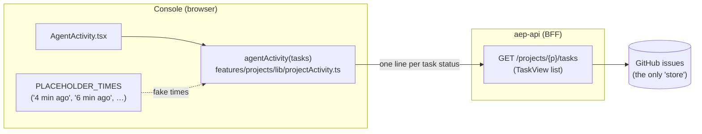

# Agent Activity feed — how activity reaches the console (issue #239)

How the project overview's **Agent Activity** panel gets its data: where events
are produced, where the state lives, and how it travels to the console — before
(shipped in #232) versus after (backend #254 + the console follow-up PR).

## Before — client-side derivation (shipped in #232)

There is **no activity state anywhere**. The console derives the feed on render
from the build-task list, and the timestamps are hardcoded placeholders.

Consequences (why #239 exists):

- **State kept:** nowhere — the feed is a pure function of the current task
  list. History is lost the moment a task changes state.
- **Times are fiction** (`PLACEHOLDER_TIMES`); no per-task timestamps exist in
  the data.
- Only build-task statuses appear — no spec publishes, no plan derivation, no
  deploy events, no user attribution.
- With zero tasks (every project before a build), the panel is permanently
  empty.

## After — activity event store + replay/tail SSE (#254 backend + console PR)

Producers append **ActivityEvent rows** to a dedicated Postgres table at the
moment something happens; the console reads one page and then tails an SSE
stream. State lives in exactly one place: the `activity_events` table, owned by
the **projects domain** in `aep-api`.

```mermaid
flowchart LR
  subgraph Producers["Producers (aep-api)"]
    BH["delivery/build handler<br/>build start → spec_published<br/>(actor = signed-in user)"]
    WF["delivery/devflow Temporal workflows<br/>plan_derived · task_started<br/>task_deployed · task_failed<br/>(actor = plan/build agent)"]
  end

  subgraph AppRoot["app root (composition)"]
    AD["activity adapters<br/>(twin-type mapping +<br/>user identity from JWT)"]
  end

  subgraph ProjectsDomain["projects domain (owner)"]
    SVC["ActivityService.Record<br/>best-effort, never fails the caller"]
    HUB["ActivityHub<br/>in-memory per-project notify"]
    DB[("activity_events (Postgres)<br/>dedup: (org, project, dedup_key)<br/>feed index: occurred_at DESC")]
    SVC -->|"INSERT … ON CONFLICT DO NOTHING"| DB
    SVC -->|notify on real insert| HUB
  end

  subgraph Slice["projects/activityfeed slice (HTTP)"]
    LIST["GET /projects/{p}/activity<br/>keyset-paginated, newest first"]
    SSE["GET /projects/{p}/activity/stream<br/>SSE: replay + live tail"]
  end

  subgraph Console["Console (browser)"]
    Q["useProjectActivity (TanStack Query)<br/>features/activity/api/queries.ts"]
    S["openActivityStream + parseSseStream<br/>features/activity/api/stream.ts"]
    H["useActivityFeed<br/>seed page + live events, dedup by id"]
    R["render.tsx — event → sentence + tone"]
    AA2["AgentActivity.tsx (overview)"]
    Q --> H
    S --> H
    H --> R --> AA2
  end

  BH --> AD
  WF -->|"RecordActivity activity<br/>(workflow.Now → deterministic time)"| AD
  AD --> SVC
  DB --> LIST
  DB -->|replay| SSE
  HUB -->|tail wake-up| SSE
  LIST --> Q
  SSE --> S
```

### Where the state is kept

| State | Where | Owner |
|---|---|---|
| The feed itself (append-only event log) | `activity_events` table, AutoMigrated via `migrate.BaseModels()` | `internal/projects` (entity + gorm repository at the domain root) |
| Live-tail wakeups | `ActivityHub`, in-memory per `(org, project)` — no persistence needed; a reconnect replays from the table | `internal/projects` |
| Event vocabulary (`spec_published`, `task_failed`, …) | `internal/contracts/activityvocab` — a pure leaf both producers (delivery) and the owner (projects) import | shared contract |
| Console's copy | TanStack Query cache (first page) + `useActivityFeed` in-memory live list, deduped by event `id` | `apps/console/src/features/activity` |

### Why the indirections

- **Twin types at the domain boundary.** `projects` already imports `delivery`,
  so delivery's producers cannot import `projects` back. Devflow records
  through its own `RecordedActivity` type and the build slice through a
  `SpecPublishedRecorder` port; app-root adapters
  (`internal/app/activity_adapters.go`) map onto `projects.ActivityInput`.
- **DedupKey, not at-most-once delivery.** Temporal retries and webhook
  redeliveries re-emit events; the `(org, project, dedup_key)` unique index
  makes a re-emit a no-op, and only a real insert notifies the hub.
- **Replay + tail, not a fragile push channel.** The SSE stream replays recent
  rows on every (re)connect; the client dedups by `id`. A dropped connection
  costs nothing — the same pattern as the task-log stream.
- **Best-effort recording.** `ActivityService.Record` swallows storage errors:
  the feed is observability, and must never fail a build or a workflow.

## Diff — previous vs with the new PRs

| | Before (#232 only) | After (#254 + console PR) |
|---|---|---|
| Source of truth | none — derived from the task list on render | `activity_events` table (append-only) |
| Event coverage | build-task statuses only | spec_published, plan_derived, task_started, task_deployed, task_failed (taxonomy extensible via `activityvocab`) |
| Timestamps | hardcoded `PLACEHOLDER_TIMES` | real `occurredAt` (workflow-deterministic inside Temporal) |
| Actor | implicit "Build agent" | user (email + display name from JWT) or agent, rendered viewer-relative ("You") |
| Liveness | refetch-only | SSE live tail with replay-based reconnect |
| Pagination | n/a | keyset cursor `(occurred_at, id)`, newest first |
| Console data path | `agentActivity(tasks)` in `features/projects/lib/projectActivity.ts` | `features/activity/` (queries + stream + `useActivityFeed` + `render`) |
| Contract | none | `GET /projects/{p}/activity` + `GET /projects/{p}/activity/stream` in `packages/contracts/api/v1/openapi.yaml` |

## PR map

- **#232** (`aep-rewrite-latest`) — console polish; contains the *before*
  state (mock-derived panel). No activity backend.
- **#254** (`feat/agent-activity-backend`) — everything server-side above:
  store, producers, read API, SSE stream, contract. After the upstream merge,
  the feature lives in the domain layout (projects domain + activityfeed
  slice + activityvocab leaf + app-root adapters).
- **Console follow-up PR** (to cut from the local `aep-rewrite-latest` FE
  commits) — `features/activity/` data layer and `AgentActivity` consuming the
  real feed; deletes `PLACEHOLDER_TIMES`. Depends on #254's contract types.
