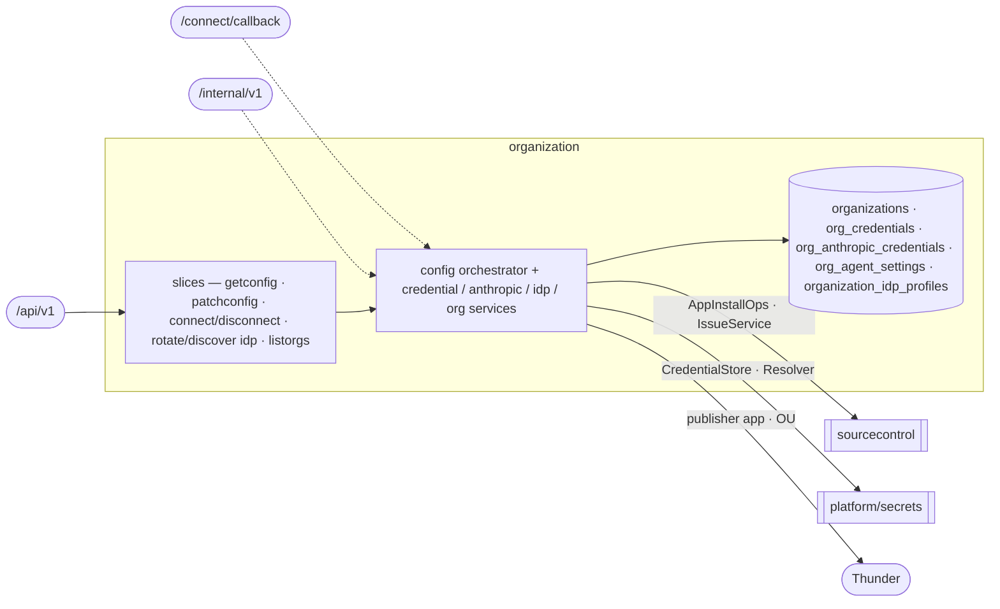

# organization — Organization Onboarding & Settings

> **L2 · a domain.** Part of the [aep-api architecture](../../README.md).

Bring a tenant org onto the platform (JIT onboarding + the phantom-OU trust guard) and own every
per-org, org-keyed record that configures its integrations — GitHub credential, the AI agents card
(Anthropic key, model, coding runtime, Claude subscription), IDP publisher — all fronted by the
consolidated `/config` resource.

## Slices
| Slice | Use-case | Entry |
|---|---|---|
| `getconfig` `patchconfig` | read / atomic multi-section write of the org config | `GET`+`PATCH .../config` |
| `connectgithub` `disconnectgithub` | start GitHub App connect / disconnect cascade | `POST .../config:connect-git-provider` etc. |
| `rotateidp` `discoveridp` | rotate the publisher client secret / OIDC discovery | `POST .../config:rotate-idp-secret` etc. |
| `listorgs` | enumerate orgs (tenant-gate carve-out — no org ctx) | `GET /organizations` |

*Still flat in the domain root (not carved into slices): the credential / anthropic / agent-settings /
idp services, the raw connect-callback controller, and the S2S credentials-refresh.*

## Ports
| Port | Dir | Peer · contract |
|---|---|---|
| `AppInstallOps` · `IssueService` | needs | `sourcecontrol` — App/PAT probes, disconnect issue cascade |
| `CredentialStore` · `Resolver` · `AppTokenMinter` | needs | `platform/secrets` — sealed git-token/anthropic store, credential resolution |
| `thundersvc` · `secretmanagersvc` | needs | publisher-app CRUD + OU check · secret-ref mirror |
| `OrganizationService` · `CredentialService` · `AnthropicCredentialService` · `IDPService` | offers | `delivery` (coding identity/key/publisher) · `sourcecontrol` (credential resolution) |
| `AgentSettingsService` | offers | `delivery` (the run's model + runtime) · the app root (the spec agents' per-turn model) |
| `CredentialsRefreshService` | offers | the S2S runner-refresh op (edge projects it onto `igen.RefreshResponse`) |

## Owns
- `organizations` (+ `thunder_org_uuid`, `llm_disconnected_at`), `org_credentials`,
  `org_anthropic_credentials` (keyed `(oc_org_id, role)` — the `default` API key and the optional
  `coding` Claude subscription), `org_agent_settings` (one row per org, absent = the platform defaults),
  `organization_idp_profiles` + `idp_audit_events` — gorm + entities in this domain (`entity_*.go` over
  `repository_*.go`), single write-authority.

## Invariants — don't break
- **The phantom-OU trust guard** (`ouIsTrustworthy`): reject a JWT `ouId` ONLY when a wired validator
  positively reports it does not exist; empty id / no validator / transient error all fail-open. A phantom
  OU poisons `wc-` namespace derivation + the publisher OU binding. Both write paths are guarded.
- **This domain is FAIL-LOUD**, not nil-tolerant: a nil collaborator panics (its pre-migration handlers had
  no nil guard), unlike sourcecontrol's 503 — the edge assigns it directly, no `OrEmpty`.
- The `/config` PATCH is an **atomic multi-section** apply; sections are three-state `patch.Field`.
- **The AI agents card is `llm` + `agents`, and one save of it is ONE transaction** (ADR-0036):
  `AgentSettingsService` writes the credential rows, the `org_agent_settings` row and the
  `org_secrets` bytes under one per-org advisory lock (`org_anthropic:<org>`), the secret store
  joining the transaction (`secrets.TxCredentialStore.WithDB`, `repository_agents_card.go`). A
  failure anywhere writes nothing. It is the ONLY writer of credential rows. The SM-API copy is
  mirrored after commit, best-effort; a deleted credential's copy is deleted after commit by the
  `secret_ref_name` read before the row went.
- **One rule, judged on the state the patch leaves** (`judgeCard`, `agents_rule.go`): a Claude
  subscription needs the `claude-code` runtime and a connected API key. Choosing `opencode`,
  `llm: null` and `agents: null` delete the stored token in the same transaction; a patch that
  sets a token its end state cannot use is refused on `body.agents`
  (`agents_subscription_requires_claude_code` / `agents_subscription_requires_api_key`). The
  patch is judged before the live probes and again inside the transaction.
- **The `coding` role holds a Claude subscription token only; the `default` role an API key
  only** — CHECK `org_anthropic_credentials_role_kind`, and `ValidateKey` refuses the wrong kind
  per role before any probe. There is no separate coding API key.
- **`agents` is never null on the wire**: every org has an effective model and runtime, so the
  section carries the platform's defaults until somebody chooses, and `updatedBy` tells "on the
  defaults" from "chose the defaults". `null` on the PATCH **resets** — the row is deleted, and
  the subscription with it. Its fields are individually optional: an omitted model or runtime
  keeps the stored one, and the token is sent only when it changes. `AgentRuntimes` /
  `AgentModels` (`platform/orgconfig`) are pinned against the committed contract's enums by a
  test.
- **A runtime is never substituted.** A name outside the `AgentRuntime` enum is refused by name;
  running another runtime would bill an organization for one it did not choose and never tell it.
- **`agents.model` is the one model every agent uses**: the spec agents resolve it with the key
  per turn; a coding run copies it at dispatch and uses it for the lead, every subagent and the
  runtime's own helper calls.
- **The `AgentModel` enum is the set the platform can PRICE.** `modelcost.SumCost` is
  all-or-nothing across a cycle's capture, so one model with no `model_rates` row blanks the whole
  cycle's cost rather than just its own share. Offering a model is a rate row and a contract
  change together, never one without the other.
- **`llm_disconnected_at`** on `organizations` records the last key disconnect (the credential row
  is deleted, so it is the only trace the org had a key); projected as `llmDisconnectedAt` while
  `llm` is null, cleared by the next key save.
- **Exactly one credential variable reaches a coding run.** `credential_kind` (`api_key` |
  `oauth_token`) is persisted, not re-derived — dispatch reads the row and never the secret bytes — and
  picks `ANTHROPIC_API_KEY` xor `CLAUDE_CODE_OAUTH_TOKEN`. Claude Code ranks the former above the
  latter, so mounting both would silently ignore an org's subscription token.
- `ResolveCodingSecretRef(ctx, org, runtime)` is the **single** statement of which credential a
  coding run mounts: the subscription only when the runtime is `claude-code`, the API key otherwise.
  It fails closed: a configured-but-unusable subscription aborts the dispatch rather than quietly
  billing API credits. Every other reader (`EffectiveKey`, the RCA push) is default-only by
  construction.
- **Orphaned SM-API copies are accepted.** The migration that removed separate coding API keys
  (`phase16_coding_role_subscription_only`) could not delete their vault copies (entity
  `anthropic-coding`; a delete needs a signed-in user's context), and a failed post-commit delete
  leaves the same. Nothing reads them; the next subscription save overwrites that path.
- **Publisher SecretReference for coding Jobs is fail-closed on `POST /build`.**
  `ProvisionPublisherForBuild` (actor `build-provision`) ensures the Thunder publisher app and stamps
  `secret_ref_name` while the console JWT is on ctx. A missing or disabled `SecretRefWriter` returns
  an error (Build 503) and does not touch Thunder. `EnsureOrgPublisher` on the deployment path still
  swallows SM-API errors. Coding dispatch reads `secret_ref_name` only.
- **`OrgCatalogVaultKey` reconstructs a Registered External's org-catalog vault path from the
  request JWT `ouId`** — a read, not a second write. Used after aep-api restart when the
  process-local value plane is empty (ADR-0021). A missing `ouId` cannot invent a path.
- Org config wire types (`ConfigProjection`/`ConfigPatch`/`*Projection`) are hand-written pure DTOs in
  `models/` (codegen can't express them) — referenced directly, **not** a wire/domain split.
- The `ListOrganizations` op is the one tenant-gate carve-out (it carries no org context). Platform-wide
  rules (tenant gate, secrets fence) → [../../README.md](../../README.md).
