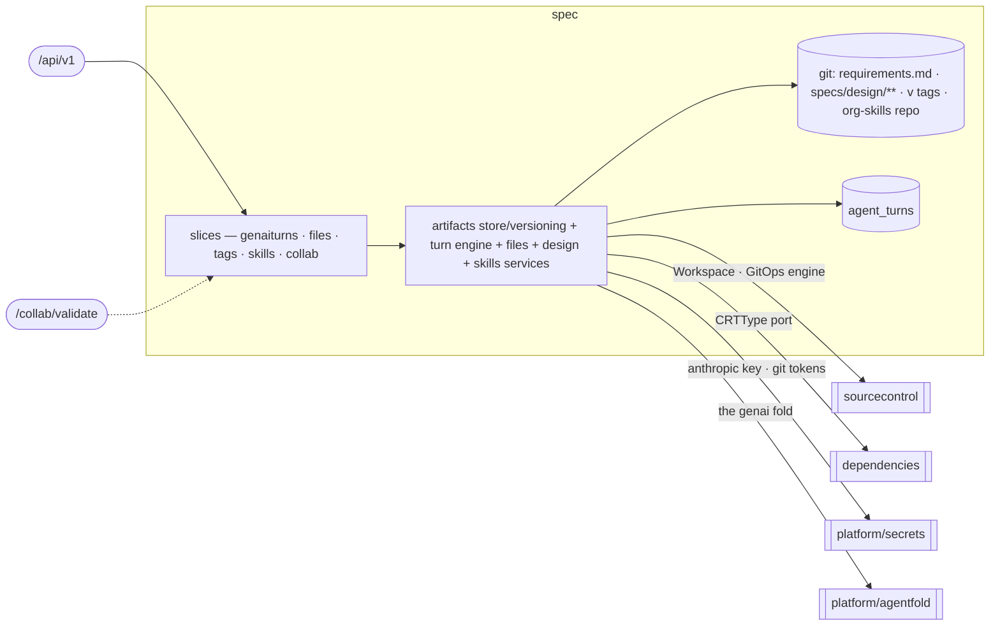

# spec — Spec Authoring & Versioning

> **L2 · a domain.** Part of the [aep-api architecture](../../README.md).

Turn a prompt into a versioned requirements+design Spec stored as committed truth in git, let humans and
agents co-edit it live, cut and read the `v<N>` Spec version, and steer authoring with the org's Skill
library. **Single write-authority over the git spec-content store and its version tags.**

## Slices
| Slice | Use-cases | Entry |
|---|---|---|
| `genaiturns` | create / get / active / stream turn + get-conversation (the AgentTurn lifecycle) | `.../agents/{cid}/messages`, `.../turns/...` |
| `files` | list / read / apply files over the project workspace | `GET/POST .../files...` |
| `tags` | list the project's `v<N>` spec version tags | `GET .../tags` |
| `skills` | list / create / update / delete / import / sync / get the org Skill library | `/skills...` |
| `collab` | the collab session descriptor + the S2S room-access oracle | `.../spec/collab-session`, `GET /collab/validate` |

*Still flat in the domain root (not carved into finer slices): the artifacts store/versioning machinery,
the genai turn engine (runner/broker/sweeper), and the files / design / skills services.*

## Ports
| Port | Dir | Peer · contract |
|---|---|---|
| `Workspace` · `GitOpsService` · `RepoService` | needs | `sourcecontrol` — the gitfs engine hosting all spec + skills git content |
| `resourceTypeCatalog` (returns `CRTType`) | needs | `dependencies` — the PE-authored CRT markers + declared outputs, projected at the root |
| `AnthropicKeyResolver` · git-token `Resolver` | needs | `platform/secrets` — per-org keys + sealed git tokens |
| `ArtifactService` · `ArtifactStore` · `SplitFrontmatter` | offers | `delivery` / `projects` / `dependencies` — design reads, spec-save, status snapshots |
| `CredentialsRefreshService`-adjacent turn/tag reads | offers | delivery/build (SpecTagger, validation criteria) |

## Owns
- git spec content (`requirements.md`, `specs/design/**`), the annotated `v<N>` tag (the version store),
  the org-skills repo, `AgentTurn` (turn lifecycle) + the resumable-turn SSE broker (in-memory seam).
- **The Skill library.** One flat authored library at repo-root `skills/`, COPY'd into the image and read
  at runtime from `config.SkillsDir` (default `/app/skills`) — not go:embed'd. A skill dir is `SKILL.md`
  plus the [Agent Skills standard structure](https://agentskills.io/specification) — `scripts/`,
  `references/`, `assets/`, and any other files or directories — carried byte-faithfully end to end
  (loader → reconcile → org-skills repo → design agent → coding runner); scanners walk the whole dir with
  no extension filter, skipping only `SKILL.md` itself and dotfile segments; `scripts/` files materialize
  with the exec bit on the coding runner. Kind (`platform | org | custom | imported`) lives in frontmatter
  `metadata.aep.kind`, absent ⇒ `org`: platform/org are library-shipped + reconcile-managed (read-only),
  custom/imported are user-owned + editable — the same aux-file contract governs user-facing create/update
  and tarball import, rejecting any `..`/absolute path outright rather than silently dropping it. Each
  org's flat `org-skills` repo (kind in frontmatter) is reconciled content-SHA-wise — seed / overwrite /
  purge platform+org, skip user-owned. Model-context reads (the design agent's `loadSkillReference`) and
  JSON API responses inline UTF-8 text only; binary aux files are listed, never inlined
  (`binaryReferences` in the API; a corrective error naming the binary path in the tool). Binary aux
  files are therefore delivery-only over the JSON API — their content never round-trips through a
  GET→edit→PUT cycle — and stay durable only via the embedded library or tarball import, which carry
  the bytes directly rather than through `binaryReferences`.
- **Persistence**: the `agent_turns` gorm lives in this domain (`repository_turn.go` over the
  `agent_turn.go` entity), single write-authority. Spec content itself is not gorm — it lives in git,
  reached through sourcecontrol's `Workspace`/gitfs engine.

## Invariants — don't break
- **Single write-authority** over the git spec-content store and its `v<N>` tags — every save/tag/discard
  runs through this domain's gitfs Workspace engine; no other domain writes spec content.
- **`CRTType` is a projection, not a re-export.** design-save reads the dependencies resource-type catalog
  through the `resourceTypeCatalog` port in spec's OWN vocabulary (`CRTType`), mapped by a root
  adapter — the spec domain names the dependencies domain nowhere.
- **Design save DERIVES two platform facts, in one pass over one catalog call** (`derive.go`, ADR-0013):
  `exposesAPI.auth` off a resource type's role marker (`derive_auth.go`), and each `platform-resource` /
  `external` dependency's `wiring` — the OC ref plus output→env-var mapping the coding agent copies into
  `workload.yaml` (`derive_wiring.go`). Both mutate the design in place and commit only the components whose
  derived state actually changed, so an unchanged design commits nothing.
  - Derived, therefore **re-derived and overwritten every pass** — which is exactly what lets the write
    gates ACCEPT `wiring` instead of rejecting it as agent-authored: the design agent reads-edits-writes
    `design.json`, so a rejection rule would reject its own echo.
  - Both env-var and ref naming route through `platform/ocname`, the SAME helper the dependencies domain
    injects pod env vars with. The two must agree byte-for-byte or the agent's `workload.yaml` references a
    resource that does not exist; a bounded-name test pins it.
  - Fail-closed: a design declaring a platform-resource whose catalog is unreachable returns
    `ErrResourceCatalogUnavailable` (503) rather than silently skipping either derivation.
- The `/collab/validate` oracle recovers the acting org from VERIFIED claims and refuses any room whose
  `spec-<org>-` prefix mismatches — never a hint of whether the room exists. Platform-wide rules (tenant
  gate, secrets fence) → [../../README.md](../../README.md).
- The genai turn is **committed-truth**: the fold (`platform/agentfold`) verifies hash-parity before the
  commit; a mismatch rejects the turn and leaves `main` untouched.
- **Skill read-only is enforced by the mutation guards, not by visibility.** `Resolve`/`List` return every
  kind — platform skills list read-only on the skills page; reserved names/prefixes block name collisions.
